#Xiu签

* [Github](https://github.com/MISSZQ/XiuQian)
* [HostedRedmine](http://10.7.1.5/projects/android_xiu/wiki)

### 项目简介
### 项目功能介绍
### 项目成员
* 王寅达（项目经理、开发工程师）
  * Email: <1733220383@qq.com>
  * Github: [https://github.com/WindSul](https://github.com/WindSul)
* 高思雨（数据库工程师、开发工程师）
  * Email:<1060970075@qq.com>
  * Github:[https://github.com/siyu-gao](https://github.com/siyu-gao)
* 丁雪怡（UI设计师、开发工程师）
  * Email:<dingxueyidxy@foxmail.com>
  * Github:[https://github.com/dingxueyi](https://github.com/dingxueyi)
* 杨永昊（研发人员、开发工程师）
  * Email:<15531809228@sina.cn>
  * Github:[https://github.com/xiaoHaoZ1](https://github.com/xiaoHaoZ1)
* 王静楠（测试工程师）
  * Email:<18713923868@163.com>
  * Github:[https://github.com/wangjingnana](https://github.com/wangjingnana)
* 赵蕾（UI设计师、开发工程师）
  * Email:<455872507@qq.com>
  * Github:[https://github.com/zhaoleiZ](https://github.com/zhaoleiZ)
* 孙南（产品经理、开发工程师）
  * Email:<njsunnan@outlook.com>
  * Github:[https://github.com/MISSZQ](https://github.com/MISSZQ)
### 运行效果
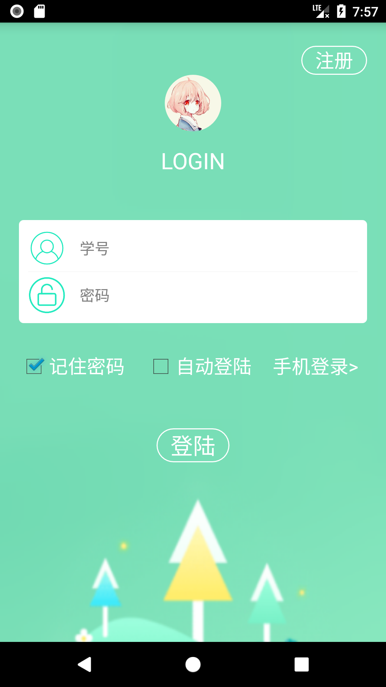           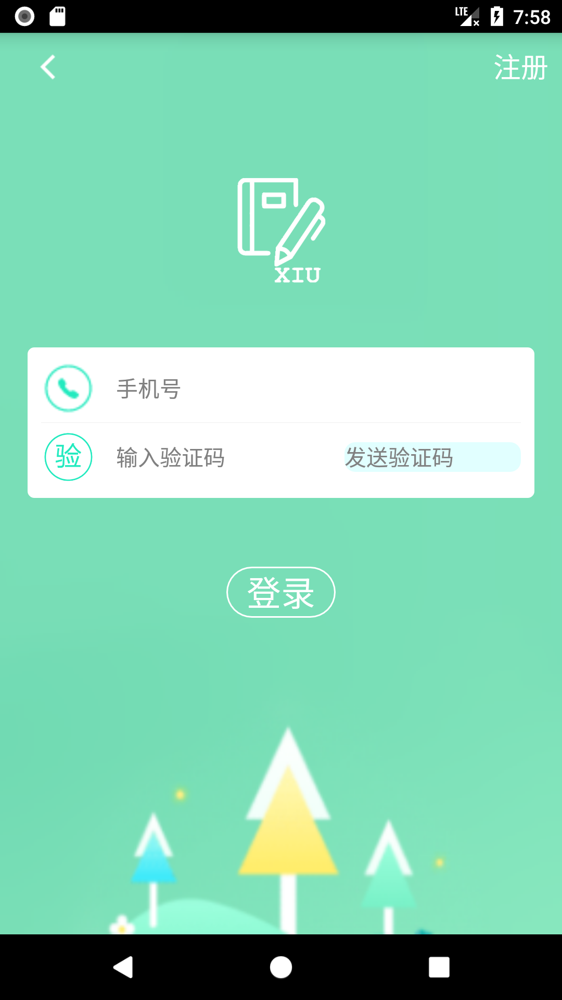
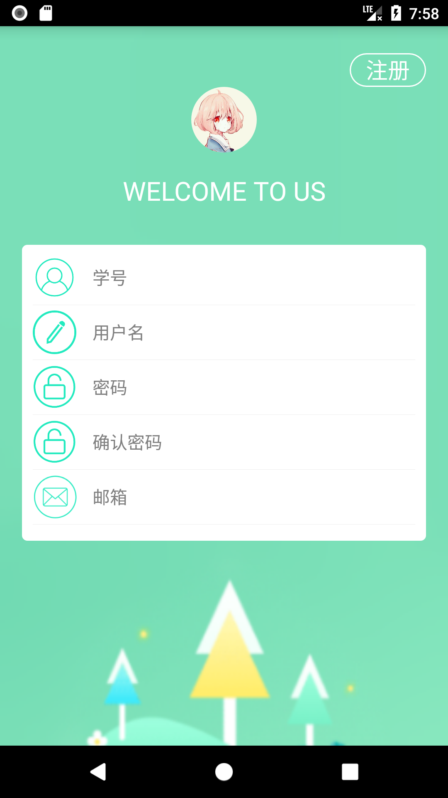           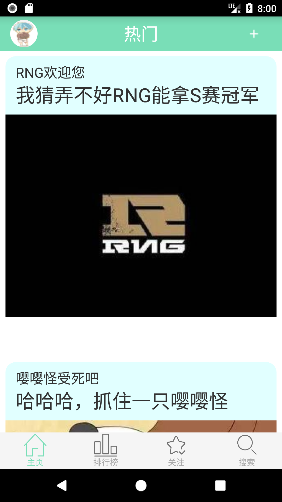
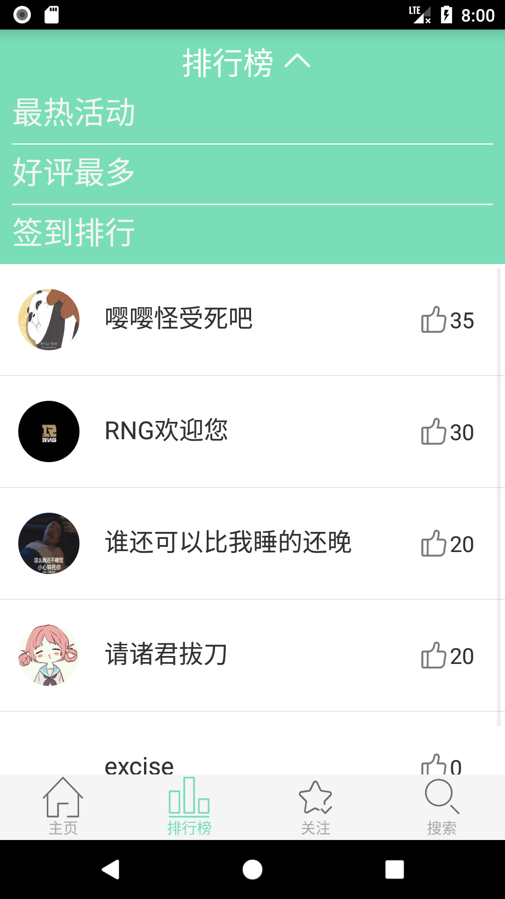           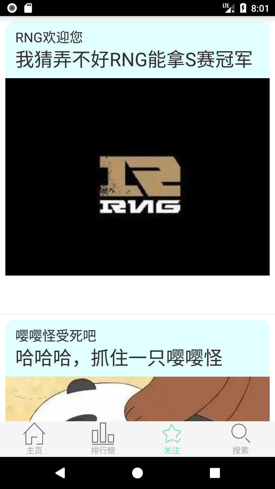
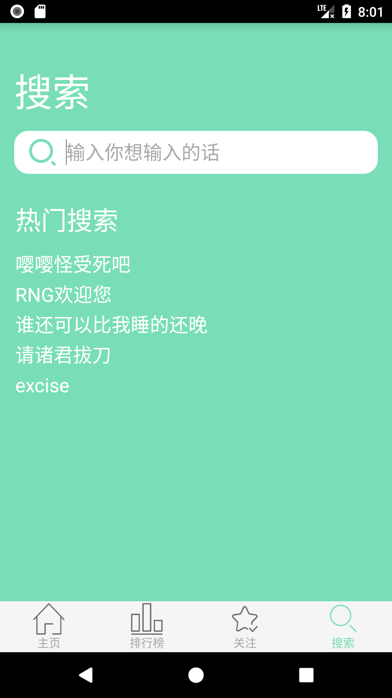
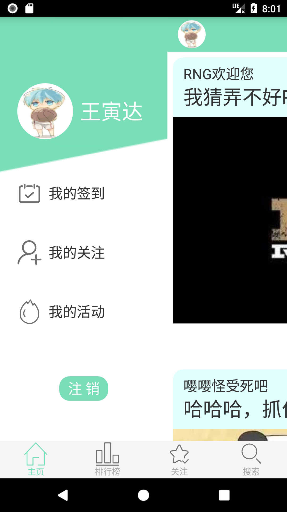
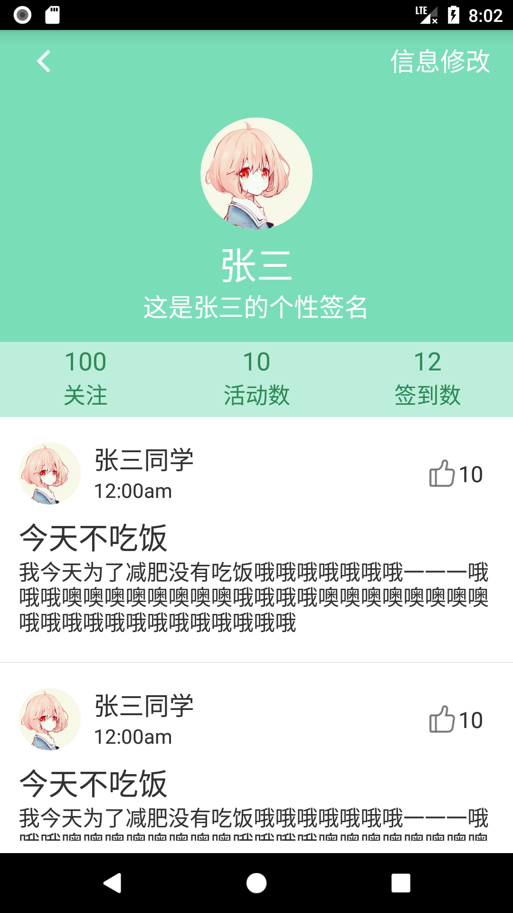
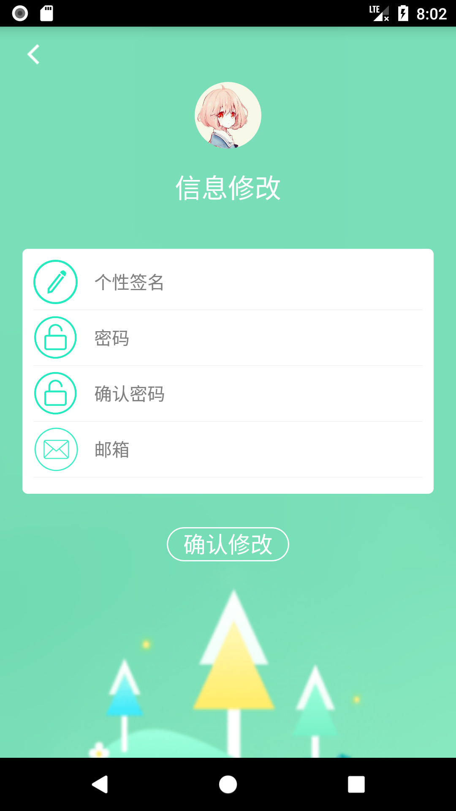
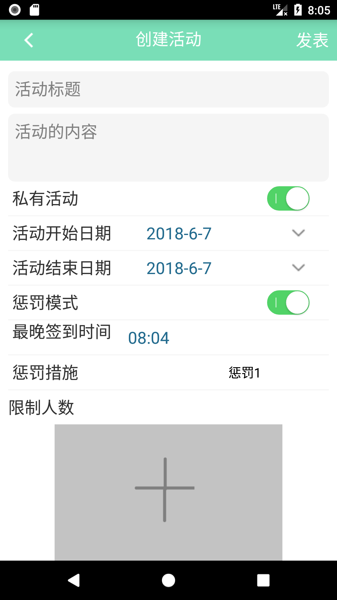
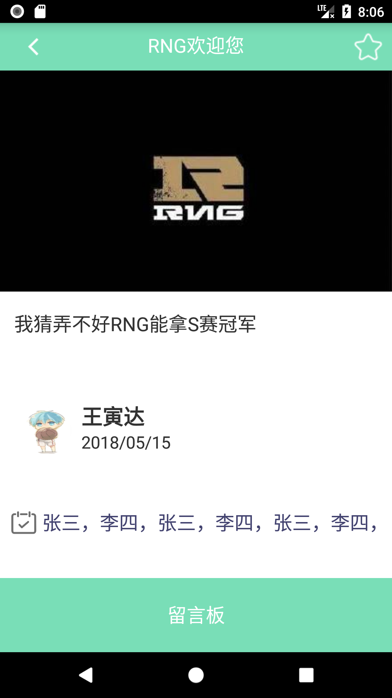

